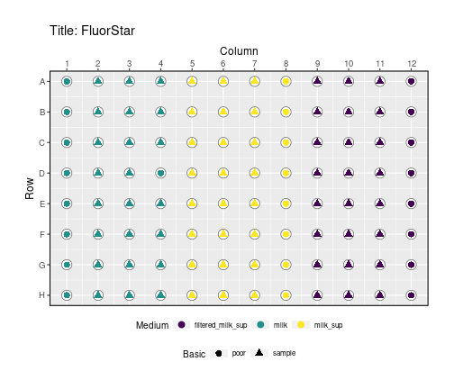

<p align="justify">


# mpxtractor 
**An R package to extract data from plate reader output raw files into a tidy data frame. Plot layout files and plot growth rates over microplate frame.**
<div style="text-align: justify"> 
The main function of mpxtractor is to provide a simple method that can process raw data from microplate readers like SpectraMax, FluorStar, and MultiscanGO and apply different methods to it. This package generates tidy data frames, this data can be combined with layout files, and then growth rates are calculated and plot over a microplate frame. This is a critical point in several research lines performing experiments using microplate reader machines mainly due to the time that takes to clean and sort the raw data into a tidy format. Also, the features of this package allow detecting which wells present faulty data e.g wells not filled correctly. Another feature of mpxtractor is that it allows plotting the layout file over a microplate frame, this is very useful because it is easy to visualize the layout, this is handy in the lab to set the experiment. This package main contribution is orientated to save time and get fast into data analysis.

For the reasons mentioned above is why mpxtractor can help to reduce the time to process the raw data into tidy data frames, combine layout files with tidy data. Also, mpxtractor provides features to visualize growth curves and layout files over a microplate frame. The latter can be printed to be used in the lab during the set up of experiments.


## Features of `mpxtractor` 
This package is divided by two sets of functions

**1.** Function to wrangling the data in raw files, this functions are explained in 
detail in vignette `wrangling_and_layout_functions` along side with some examples.

**2.** Functions to plot layout files and growth curves, the vignette `plotting_functions` explain how they work and some details.


## Installation 


```r
# The development version from GitHub:
# install.packages("mpxtractor")
devtools::install_github("MartinBanchero/mpxtractor")
```

## Usage
### Example
#### Layout design and visualization

Lets suppose we want to perform an experiment to measure growth rates under different type of sugars. The first step is to design the layout. Using `mpxtractor` we can load the layout file into a tidy data frame.

```r
layout_file <- system.file("extdata", "test_fluorstar_layout.csv", package = "mpxtractor")

df_layout <- mpxtractor::read_layout_file(file = layout_file)
head(df_layout)
#> # A tibble: 6 x 3
#>   Wells Basic  Medium  
#>   <chr> <chr>  <chr>   
#> 1 A01   poor   milk    
#> 2 A02   sample milk    
#> 3 A03   sample milk    
#> 4 A04   sample milk    
#> 5 A05   sample milk_sup
#> 6 A06   sample milk_sup
```

Now we want to set the microplates and run the experiment in the lab, for this we can use the `plot_layout_file()` function that provide a visualization of our experimental design. For example, to avoid edge effects due to temperature, evaporation, etc. the wells around the perimeter of the plate might be more sensitive to this effects, visualizing the layout design over the microplate give an easy way to check whether the control or the samples are well positioned in the plate. In **Fig.1** is shown the `basic` and the `Medium` conditions over the microplate.  


```r

#get the path to file
file <- system.file(
  "extdata",
  "test_fluorstar_layout.csv",
  package = "mpxtractor"
)

mpxtractor::plot_layout_file(file,
  var_shape = "Basic",
  var_colour = "Medium",
  plate_title = "Title: FluorStar"
)
```

 


### Data wrangling
Once all the experimental design is complete we are ready to use the microplate reader machines. In this example we are using a fluorStar to measure our growth rates. 
Within `mpxtractor` we can find one wrangling function for each machine, in this
case we going to use `read_fluorstar_data()` (see vignette `wrangling_and_layout_functions`) to store the raw data into a tidy dataframe.


```r
file <- system.file("extdata", "test_fluorstar_fluorescence_data.txt", package = "mpxtractor")

# Extract the data stored in the files into a data frame using proper wrangling function
df_fl <- mpxtractor::read_fluorstar_data(
  file = file
)

# Show tidy data 
head(df_fl) 
#> # A tibble: 6 x 5
#>   Wells Sample Time     Measurement wavelength
#>   <chr> <chr>  <chr>          <int> <chr>     
#> 1 A01   " X1"  00:00:00      186705 485, 520  
#> 2 A01   " X1"  00:02:00      186950 485, 520  
#> 3 A01   " X1"  00:07:00      188978 485, 520  
#> 4 A01   " X1"  00:12:00      189018 485, 520  
#> 5 A01   " X1"  00:17:00      189620 485, 520  
#> 6 A01   " X1"  00:22:00      191198 485, 520
```

Now let's suppose we want to repeat the experiment but this time we want to measure absorbance under the same conditions. In this case we have two raw data files to be analyzed. Using the function `read_multiple_data_files()` we can store both files into a tidy dataframe. There many options that can be used to gather files with this function, for more information check vignette `wrangling_and_layout_functions` .


```r
# Path to files
file1 <- system.file("extdata", "test_fluorstar_absorbance_data.txt", package = "mpxtractor")

file2 <- system.file("extdata", "test_fluorstar_fluorescence_data.txt", package = "mpxtractor")

df_two_files <- mpxtractor::read_multiple_data_files(
  reader_type = "fluorstar", 
  filesname = c(file1,file2), 
  plate_names = c("absorbance", "fluorescence") 
  )
head(df_two_files)
#> # A tibble: 6 x 6
#>   Wells Sample Time     Measurement wavelength plate_filename
#>   <chr> <chr>  <chr>          <dbl> <chr>      <chr>         
#> 1 A01   " X1"  00:00:00        3.5  600        absorbance    
#> 2 A01   " X1"  00:02:00        3.44 600        absorbance    
#> 3 A01   " X1"  00:07:00        3.5  600        absorbance    
#> 4 A01   " X1"  00:12:00        3.5  600        absorbance    
#> 5 A01   " X1"  00:17:00        3.21 600        absorbance    
#> 6 A01   " X1"  00:22:00        3.35 600        absorbance
tail(df_two_files)
#> # A tibble: 6 x 6
#>   Wells Sample Time     Measurement wavelength plate_filename
#>   <chr> <chr>  <chr>          <dbl> <chr>      <chr>         
#> 1 H12   " X96" 20:03:00       40309 485, 520   fluorescence  
#> 2 H12   " X96" 20:08:00       40418 485, 520   fluorescence  
#> 3 H12   " X96" 20:13:00       40438 485, 520   fluorescence  
#> 4 H12   " X96" 20:18:00       40310 485, 520   fluorescence  
#> 5 H12   " X96" 20:23:00       40357 485, 520   fluorescence  
#> 6 H12   " X96" 20:28:00       40154 485, 520   fluorescence
```
At this point we have two measurements under the same layout design. Now we want to add the layout information to our tidy data frame with both files. To do this we can use the function `combine_data_with_layout()` and store all the information in one tidy data frame.


```r
#get the path to layout file
file_layout <- system.file(
  "extdata",
  "test_fluorstar_layout.csv",
  package = "mpxtractor"
)

df_combine <- mpxtractor::combine_data_with_layout(
  df_data = df_two_files, 
  reader_type = "Fluorstar", 
  layout_files = file_layout
  )

head(df_combine)
#> # A tibble: 6 x 9
#>   Wells Sample Time     Measurement wavelength plate_filename Basic Medium layout_file         
#>   <chr> <chr>  <chr>          <dbl> <chr>      <chr>          <chr> <chr>  <chr>               
#> 1 A01   " X1"  00:00:00        3.5  600        absorbance     poor  milk   test_fluorstar_layo…
#> 2 A01   " X1"  00:02:00        3.44 600        absorbance     poor  milk   test_fluorstar_layo…
#> 3 A01   " X1"  00:07:00        3.5  600        absorbance     poor  milk   test_fluorstar_layo…
#> 4 A01   " X1"  00:12:00        3.5  600        absorbance     poor  milk   test_fluorstar_layo…
#> 5 A01   " X1"  00:17:00        3.21 600        absorbance     poor  milk   test_fluorstar_layo…
#> 6 A01   " X1"  00:22:00        3.35 600        absorbance     poor  milk   test_fluorstar_layo…
```
### Visualization of growth curves

## Learn more

To get started, first read `vignette("Introduction_to_mpxtractor")`. Then read more about the specific package components that you want to apply.

* For data wrangling and layout files, read `vignette("wrangling_and_layout_functions")`.
* For plotting functions, read `vignette("plotting_functions")`
* For auxiliary functions read `vignette("Auxiliary_functions")`
</p>
