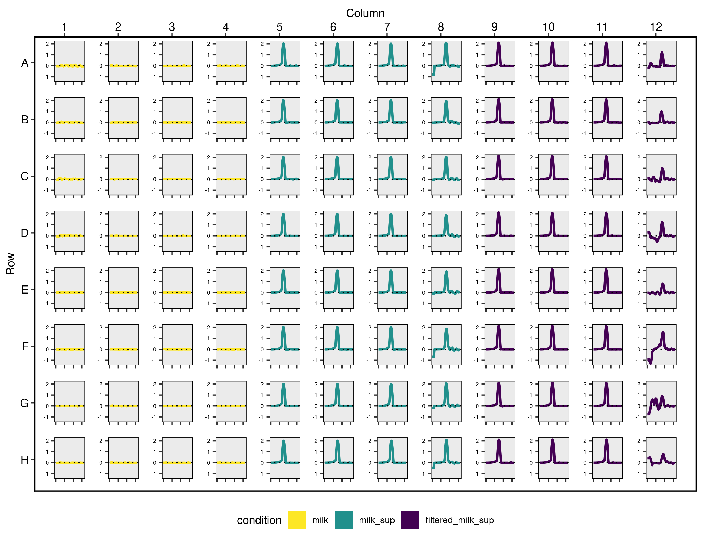

# mpxtractor
**mpxtractor: A flexible R package to process data from different plate reader machines.**

<div align="justify">

The main function of mpxtractor is to provide a simple method that can
process raw data from microplate readers like SpectraMax, FluorStar, and
MultiscanGO and apply different methods to it. This package generates
tidy tibble objects, this data can be combined with layout files, and then
growth rates are calculated and plot over a microplate frame. This is a
critical point in several research lines performing experiments using
microplate reader machines mainly due to the time that takes to clean
and sort the raw data into a tidy format. Also, the features of this
package allow detecting which wells present faulty data e.g wells not
filled correctly. Another feature of mpxtractor is that it allows
plotting the layout file over a microplate frame, this is very useful
because it is easy to visualize the layout, this is handy in the lab to
set the experiment. This package main contribution is orientated to save
time and get fast into data analysis.

For the reasons mentioned above is why mpxtractor can help to reduce the
time to process the raw data into tidy data frames, combine layout files
with tidy data. Also, mpxtractor provides features to visualize growth
curves and layout files over a microplate frame. The latter can be
printed to be used in the lab during the set up of experiments.

## Features of `mpxtractor` 
This package is divided by two sets of functions:

**1.** Function to wrangling the data in raw files, this functions are
explained in detail in vignette `wrangling_and_layout_functions` along
side with some examples.
 
  
  
| Cluster nr | ImpAnnotations           | nrOfCells Imp | Level 3 tr                                                                                                                                                                 | Level 4 tr                                                                                                                                                                                                             |   |
|------------|--------------------------|---------------|----------------------------------------------------------------------------------------------------------------------------------------------------------------------------|------------------------------------------------------------------------------------------------------------------------------------------------------------------------------------------------------------------------|---|
| 0          | Ciliated                 | 15419         | Multiciliated lineage (100%)                                                                                                                                               | Multiciliated (100%)                                                                                                                                                                                                   |   |
| 1          | Basal                    | 11214         | Basal (100%)                                                                                                                                                               | Basal resting (96%), Suprabasal (4%)                                                                                                                                                                                   |   |
| 2          | Secretory                | 10417         | Secretory (90%), Basal (5.4), Multiciliated lineage (2.6%), Submucosal Secretory (2.1%)                                                                                    | Club (76.6%), Goblet (16%), Suprabasal (4.6%), Multiciliated (2.8%)                                                                                                                                                    |   |
| 3          | Suprabasal               | 9067          | Basal (100%)                                                                                                                                                               | Suprabasal (77%) , Basal resting (23%)                                                                                                                                                                                 |   |
| 4          | Tcell                    | 7379          | T cell lineage (96.6 %), Innate lymphoid cell NK (3.4 %)                                                                                                                   | CD8 T cells (71.8 %), CD4 T cells (24.7%), NK cells (3.5%)                                                                                                                                                             |   |
| 5          | Ciliated                 | 6642          | Multiciliated lineage (100 %)                                                                                                                                              | Multiciliated (100%)                                                                                                                                                                                                   |   |
| 6          | Macrophage/Mono          | 4868          | Macrophages (69.1 %), Monocytes (16.6 %), Dendritic cells (14.3%)                                                                                                          | Alv.Macroph.(54%), Interstitial macroph. (16.9%), Classicl monocytes (15.1%), DC2 (14%)                                                                                                                                |   |
| 7          | Macropage                | 3399          | EC venous (45%), Fibroblasts (17.2%), Basal (11.6%),  Multiciliated lineage (5.8%), T cell lineage (5.6%),  2_Smooth muscle (4.5%), EC arterial (3.0%), Macrophages (2.2%) | EC venous systemic (47.2%), Peribronchial fibroblasts (16.3%), Basal resting (11.3%),  Multiciliated (6.2%), Plasma cells (5.2), 2_Smooth muscle (4.8%), CD8 T cells (3.5%),  3_EC arterial (3.2%), CD4 T cells (2,4%) |   |
| 8          | Secretory                | 2671          | Multiciliated lineage (96%), Secretory (4%)                                                                                                                                | Multiciliated (96.8%), Goblet (3.2%)                                                                                                                                                                                   |   |
| 9          | Ciliated                 | 1976          | Multiciliated lineage (100%)                                                                                                                                               | Multiciliated (100%)                                                                                                                                                                                                   |   |
| 10         | Macrophage/Mono          | 1809          | Macrophages (59.8%), Basal(29,8%), Multiciliated lineage (4.7%),  Secretory (3.6%), T cell lineage (2.2 %)                                                                 | Alv.Macroph.(62.8 %), Basal resting (21.6), Suprabasal (10.3%), Multiciliated (5.3%)                                                                                                                                   |   |
| 11         | Ciliated                 | 1260          | Multiciliated lineage (91.3%), Secretory (8.7%)                                                                                                                            | Multiciliated (66.6 %), Deuterosomal (26.5), Goblet (7 %)                                                                                                                                                              |   |
| 12         | Proliferating_basal      | 562           | Basal (97.8%), Secretory (2.2%)                                                                                                                                            | Suprabasal (84.5 %), Basal resting (15.5 %)                                                                                                                                                                            |   |
| 13         | Mast_cell                | 336           | Mast cells (100%)                                                                                                                                                          | Mast cells (100%)                                                                                                                                                                                                      |   |
| 14         | Dendritic_cell           | 319           | B cell lineage (85.4%), Dendritic cells (14.6%)                                                                                                                            | B cells (86%), Plasmacytoid DCs (14%)                                                                                                                                                                                  |   |
| 15         | Proliferating_macrophage | 262           | Macrophages (89.2 %), T cell lineage (7.2 %), Multiciliated lineage (3.6%)                                                                                                 | Alv.Macroph.(90.9%), T cell proliferating (6.6%), Deuterosomal (2.5%)                                                                                                                                                  |   |
| 16         | Ionocyte                 | 219           | Rare (96.7%), Basal (3.3%)                                                                                                                                                 | Ionocyte (85.9%), Neuroendocrine (7.3%), Tuft (6.8 %)                                                                                                                                                                  |   |
| 17         | Ciliated                 | 153           | Multiciliated lineage (100%)             

**2.** Functions to plot layout files and growth rates, the vignette
`plotting_functions` explain how they work and some details.

## Installation

``` r
# The development version from GitHub:
# install.packages("mpxtractor")
devtools::install_github("MartinBanchero/mpxtractor")
```

## Usage

### Example

#### Layout design file and visualization

Lets suppose we want to perform an experiment to measure growth rates
under different type of sugars. The first step is to design the layout.
Using `mpxtractor` we can load the layout file into a tidy data frame.

``` r
layout_file <- system.file("extdata", "test_layout_file.csv", package = "mpxtractor")

df_layout <- mpxtractor::read_layout_file(file = layout_file)
head(df_layout)
#> # A tibble: 6 x 5
#>   Wells basic   condition strain concentration
#>   <chr> <chr>   <chr>     <chr>          <dbl>
#> 1 A01   control water     water        100    
#> 2 A02   control water     water         20    
#> 3 A03   control water     water          4    
#> 4 A04   control water     water          0.8  
#> 5 A05   control water     water          0.16 
#> 6 A06   control water     water          0.032
```

Now we want to set the microplates and run the experiment in the lab,
for this we can use the `plot_layout_file()` function that provide a
visualization of our experimental design. For example, to avoid edge
effects due to temperature, evaporation, etc. the wells around the
perimeter of the plate might be more sensitive to this effects,
visualizing the layout design over the microplate give an easy way to
check whether the control or the samples are well positioned in the
plate. In **Fig.1** is shown the `basic` and the `Medium` conditions
over the microplate.

``` r

#get the path to file
file <- system.file(
  "extdata",
  "test_fluorstar_layout.csv",
  package = "mpxtractor"
)

plot <- mpxtractor::plot_layout_file(
  file = file,
  add_conc = TRUE, 
  var_shape = "Basic",
  var_colour = "Medium",
  output_filename = "layout_visualization.png"
)
```

<div class="figure" style="text-align: center">

<p class="caption">

**Figure 1:** Representation over a microplate mimic of the design file. In this case the medium was chosen to be colored.
to be coloured.
</p>
</div>

### Data wrangling

Once all the experimental design is complete we are ready to use the
microplate reader machines. In this example we are using a fluorStar to
measure our growth rates. Within `mpxtractor` we can find one wrangling
function for each machine, in this case we going to use
`read_fluorstar_data()` (see vignette `wrangling_and_layout_functions`)
to store the raw data into a tidy dataframe.

``` r
file <- system.file("extdata", "test_fluorstar_fluorescence_data.txt", package = "mpxtractor")

# Extract the data stored in the files into a data frame using proper wrangling function
df_fl <- mpxtractor::read_fluorstar_data(
  file = file
)

# Show tidy data 
head(df_fl) 
#> # A tibble: 6 x 5
#>   Wells Sample Time     Measurement wavelength
#>   <chr> <chr>  <chr>          <int> <chr>     
#> 1 A01   " X1"  00:00:00      186705 485, 520  
#> 2 A01   " X1"  00:02:00      186950 485, 520  
#> 3 A01   " X1"  00:07:00      188978 485, 520  
#> 4 A01   " X1"  00:12:00      189018 485, 520  
#> 5 A01   " X1"  00:17:00      189620 485, 520  
#> 6 A01   " X1"  00:22:00      191198 485, 520
```

Now let’s suppose we want to repeat the experiment but this time we want
to measure absorbance under the same conditions. In this case we have
two raw data files to be analyzed. Using the function
`read_multiple_data_files()` we can store both files into a tidy
dataframe. There many options that can be used to gather files with this
function, for more information check vignette
`wrangling_and_layout_functions` .

``` r
# Path to files
file1 <- system.file("extdata", "test_fluorstar_absorbance_data.txt", package = "mpxtractor")

file2 <- system.file("extdata", "test_fluorstar_fluorescence_data.txt", package = "mpxtractor")

df_two_files <- mpxtractor::read_multiple_data_files(
  reader_type = "fluorstar", 
  filesname = c(file1,file2), 
  plate_names = c("absorbance", "fluorescence") 
  )
head(df_two_files)
#> # A tibble: 6 x 6
#>   Wells Sample Time     Measurement wavelength plate_filename
#>   <chr> <chr>  <chr>          <dbl> <chr>      <chr>         
#> 1 A01   " X1"  00:00:00        3.5  600        absorbance    
#> 2 A01   " X1"  00:02:00        3.44 600        absorbance    
#> 3 A01   " X1"  00:07:00        3.5  600        absorbance    
#> 4 A01   " X1"  00:12:00        3.5  600        absorbance    
#> 5 A01   " X1"  00:17:00        3.21 600        absorbance    
#> 6 A01   " X1"  00:22:00        3.35 600        absorbance
tail(df_two_files)
#> # A tibble: 6 x 6
#>   Wells Sample Time     Measurement wavelength plate_filename
#>   <chr> <chr>  <chr>          <dbl> <chr>      <chr>         
#> 1 H12   " X96" 20:03:00       40309 485, 520   fluorescence  
#> 2 H12   " X96" 20:08:00       40418 485, 520   fluorescence  
#> 3 H12   " X96" 20:13:00       40438 485, 520   fluorescence  
#> 4 H12   " X96" 20:18:00       40310 485, 520   fluorescence  
#> 5 H12   " X96" 20:23:00       40357 485, 520   fluorescence  
#> 6 H12   " X96" 20:28:00       40154 485, 520   fluorescence
```

At this point we have two measurements under the same layout design. Now
we want to add the layout information to our tidy data frame with both
files. To do this we can use the function `combine_data_with_layout()`
and store all the information in one tidy data frame.

``` r
#get the path to layout file
file_layout <- system.file(
  "extdata",
  "test_fluorstar_layout.csv",
  package = "mpxtractor"
)

df_combine <- mpxtractor::combine_data_with_layout(
  df_data = df_two_files, 
  reader_type = "Fluorstar", 
  layout_files = file_layout
  )

head(df_combine)
#> # A tibble: 6 x 10
#> # Groups:   Wells, plate_filename [1]
#>   Wells Sample Time  Measurement wavelength plate_filename Basic Medium concentration
#>   <chr> <chr>  <chr>       <dbl> <chr>      <chr>          <chr> <chr>          <dbl>
#> 1 A01   " X1"  00:0…        3.5  600        absorbance     poor  milk             100
#> 2 A01   " X1"  00:0…        3.44 600        absorbance     poor  milk             100
#> 3 A01   " X1"  00:0…        3.5  600        absorbance     poor  milk             100
#> 4 A01   " X1"  00:1…        3.5  600        absorbance     poor  milk             100
#> 5 A01   " X1"  00:1…        3.21 600        absorbance     poor  milk             100
#> 6 A01   " X1"  00:2…        3.35 600        absorbance     poor  milk             100
#> # … with 1 more variable: layout_file <chr>
```

### Visualization of growth rates
The last step is to calculate and plot the growth curves for each well. 
``` r
file1 <- system.file("extdata",
  "test_fluorstar_absorbance_data.txt",
  package = "mpxtractor"
)

layout_file <- system.file(
  "extdata",
  "test_fluorstar_layout.csv",
  package = "mpxtractor"
)

df_fl <- mpxtractor::read_fluorstar_data(file = file1)

df_combined <- mpxtractor::combine_data_with_layout(
  df_data = df_fl,
  reader_type = "fluorstar",
  layout_files = layout_file
)

head(df_combined)
#> # A tibble: 6 x 9
#>   Wells Sample Time     Measurement wavelength Basic Medium concentration layout_file          
#>   <chr> <chr>  <chr>          <dbl> <chr>      <chr> <chr>          <dbl> <chr>                
#> 1 A01   " X1"  00:00:00        3.5  600        poor  milk             100 test_fluorstar_layout
#> 2 A01   " X1"  00:02:00        3.44 600        poor  milk             100 test_fluorstar_layout
#> 3 A01   " X1"  00:07:00        3.5  600        poor  milk             100 test_fluorstar_layout
#> 4 A01   " X1"  00:12:00        3.5  600        poor  milk             100 test_fluorstar_layout
#> 5 A01   " X1"  00:17:00        3.21 600        poor  milk             100 test_fluorstar_layout
#> 6 A01   " X1"  00:22:00        3.35 600        poor  milk             100 test_fluorstar_layout
```

``` r
mpxtractor::plot_gr_microplate(df_fl,
  var_gr = "Measurement",
  ws = "2hs",
  cond_to_col = "Medium",
  output_filename = "fluorstar.png"
)
```
<p align="center">

</p>

<p class="caption">
 
**Figure 2:** Representation of growth rate curves per well mimicking a plate-shaped format. Note that in this case the attribute *Medium* was chosen
to be coloured.
  
</p>

## Learn more

To get started, first read `vignette("Introduction_to_mpxtractor")`.
Then read more about the specific package components that you want to
apply.

  - For data wrangling and layout files, read
    `vignette("wrangling_and_layout_functions")`.
  - For plotting functions, read `vignette("plotting_functions")`
  - For auxiliary functions read `vignette("Auxiliary_functions")`
