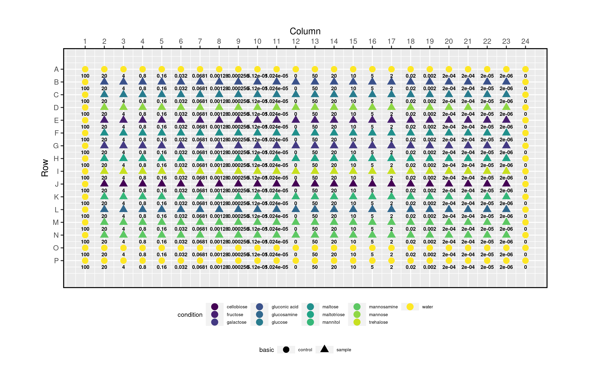
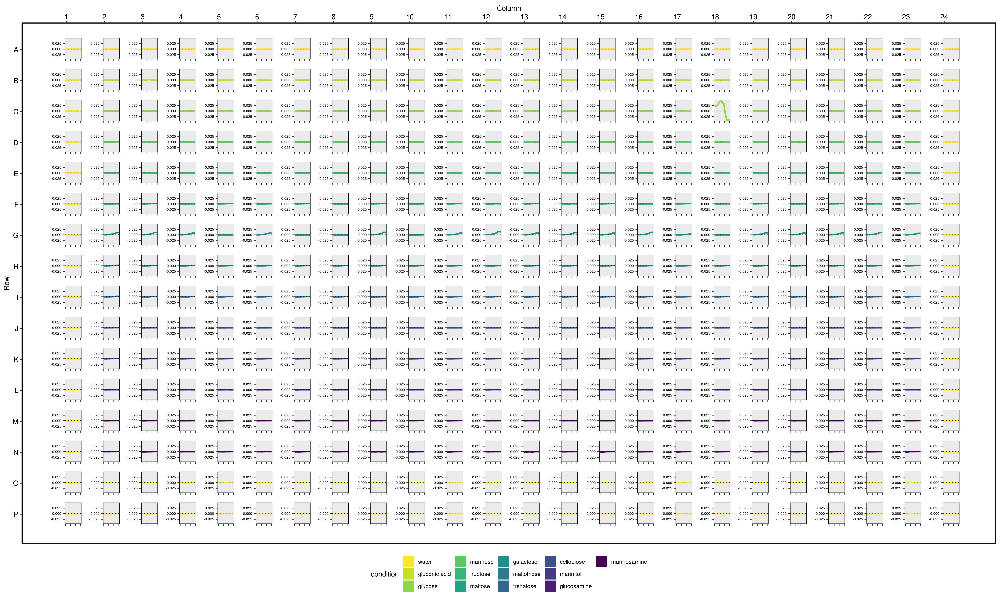

<style>
body {
text-align: justify}
</style>

```{r setup, include = FALSE}
library(mpxtractor)
library(dplyr)
options(width = "95")
knitr::opts_chunk$set(collapse = TRUE, comment = "#>", fig.align = "center", fig.show = "hold", dev = "png")
```


## Advantages of using mpxtractor
It is well known for anyone performing experiments that involved microplate readers
that the analysis of the raw data can be tedious and time-consuming. Several of this microplate reader machines include software to alleviate this problem but
many times shows a lack of standardization. Although several good R packages exist many of them are design to solve specific problems losing generability. For example, some features from @plater were used to build `mpxtractor`.  To clarify, `mpxtractor` can process
raw data from three different microplate reader machines, SpectraMax, MultiscanGO and
FluorStar.

For the reasons mentioned above is why `mpxtractor` can help to reduce the time to process the raw data into tidy data frames, combine layout files
with tidy data. Also, `mpxtractor` provides features to visualize growth curves and layout files over a microplate shape. The latter can be printed to be used in
the lab during the setups of experiments. 


## Features of `mpxtractor` 
This package is divided into two sets of functions

1. Function to wrangling the data in raw files, these functions are explained in detail in vignette `wrangling_and_layout_functions` alongside with some examples.

2. Functions to plot layout files and growth curves, the vignette `plotting_functions` explain how they work, and some details.


## Example
### Layout design and visualization

Let's suppose we want to experiment to measure growth rates under different types of sugars. The first step is to design the layout and generate the layout file. Using `mpxtractor` we can plot the layout file.  or load it into a tidy data frame.
Now we want to set the microplates and run the experiment in the lab, for this we can use the `plot_layout_file()` function to have a visualization of our experimental design. For example, to avoid edge effects due to temperature, evaporation, etc. the wells around the perimeter of the plate might be more sensitive to these effects, visualizing the layout design over the microplate is easier to check whether the control or the samples are well positioned in the plate. In **Fig.1** is shown the `basic` containing control or sample experiment while `condition` contains the type of sugar to be used in the experiment.

```{r , eval=FALSE}

layout_file <- system.file("extdata", "test_layout_file.csv", package = "mpxtractor")

mpxtractor::plot_layout_file(file = layout_file, var_shape = "basic", var_colour = "condition", add_conc = TRUE, output_filename = "spectramax_layout.png" )
```

```{r echo=FALSE ,out.width ='100%', fig.show="hold", fig.cap="**Figure 3:** Representation over a microplate frame of growth rates for each well. Note that in this case the attribute *presugar* was chosen to be coloured."}

```


As you can see in Fig.1 only two conditions can be add to this visualization, one given the shape (in this case basic) and one the color(condition).
Is possible to load the layout file into a tidy data frame using read_layout_file(). 
```{r}
layout_file <- system.file(
  "extdata",
  "test_layout_file.csv",
  package = "mpxtractor"
)

df_layout <- mpxtractor::read_layout_file(file = layout_file)

head(df_layout)
```
As we observed above we have several variables, `basic`,`condition`, `strain`and `concentration`.
For example we can join conditions and obtain a more broad visualization. 

```{r , fig.width = 7, fig.height = 8 ,out.width = "100%", out.height = "100%", fig.cap="**Figure 2:** Showing *basic* that contain control or sample, and presugar and replicate after been merge into one column."}
# We have all the layout information in a tidy dataframe obtained from before.
df_layout <- mpxtractor::read_layout_file(file = layout_file)

df_unite <- tidyr::unite(
  df_layout,
  basic_strain,
  -c(Wells, condition, concentration)
)

head(df_unite)

```

## Data wrangling
Once all the experimental design is complete we are ready to use the microplate
reader machines. In this example, we are using a multiscanGO to measure our growth rates. 
Within `mpxtractor` we can find one wrangling function for each machine, in this
case we going to use `read_multiscango_data()` (see vignette `wrangling_and_layout_functions`) to store the raw data into a tidy data frame.

**Note:** This function takes as argument time point to build the time series. In the example below the *time_point* (reading) is 2 minutes.

```{r}
file <- system.file("extdata", "test_gr_spectramax.txt", package = "mpxtractor")

# Extract the data stored in the files into a data frame using proper wrangling function
df_spmax <- mpxtractor::read_spectramax_data(file = file)

# Show tidy data 
head(df_spmax) 
```

Now let's suppose we want to repeat the experiment under the same conditions. In this case, we have to raw data files to be analyzed. Using the function `read_multiple_data_files()` we can store both files into a tidy data frame. There many options that can be used to gather files with this function, for more information check vignette `wrangling_and_layout_functions` .

```{r}
# Path to files
file1 <- system.file("extdata",
  "test_gr_spectramax.txt",
  package = "mpxtractor"
)

file2 <- system.file("extdata",
  "test_spectramax_data_2.txt",
  package = "mpxtractor"
)

df_two_files <- mpxtractor::read_multiple_data_files(
  reader_type = "spectramax",
  filesname = c(file1, file2),
  plate_names = c("plate_1", "plate_2")
)

head(df_two_files)
tail(df_two_files)

```
At this point, we have two measurements under the same layout design. Now we want to add the layout information to our tidy data frame with both files. To do this we can use the function `combine_data_with_layout()` and store all the information in one tidy data frame.

```{r}
#get the path to layout file
file_layout <- system.file(
  "extdata",
  "test_layout_file.csv",
  package = "mpxtractor"
)

df <- mpxtractor::combine_data_with_layout(
  df_data = df_two_files, 
  reader_type = "spectramax", 
  layout_files = file_layout
  )
df

```


```{r, eval = FALSE, fig.width = 10, fig.height = 7 ,out.width = "100%", out.height = "100%"}
plt <- mpxtractor::plot_gr_microplate(
  df_data = df, 
  cond_to_col = "condition", 
  var_gr = "Measurement",  
  ws = "2 hs", 
  plate_file = "plate_1", output_filename = "growth_rates.png")

```


```{r ,echo=FALSE, out.width ='100%', fig.show="hold", fig.cap="**Figure 3:** Representation over a microplate frame of growth rates for each well. Note that in this case the attribute *presugar* was chosen to be coloured."}

```

## References


