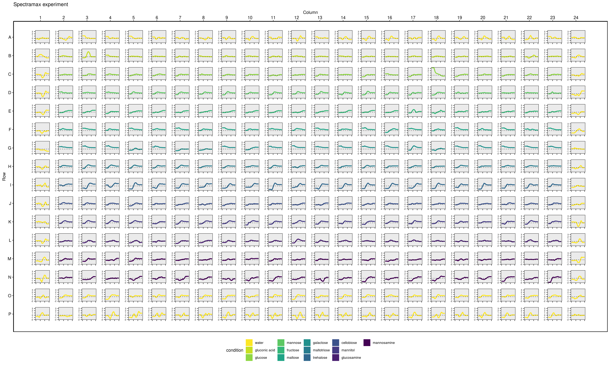

<style>
body {
text-align: justify}
</style>

```{r setup, include = FALSE}
library(mpxtractor)
library(dplyr)
knitr::opts_chunk$set(collapse = TRUE, comment = "#>", fig.align = "center", fig.show = "hold", dev = "png")
```


## Overview
This section explains two functions of `mpxtractor` to visualize the layout files  and the growth rates over a microplate representation. This functions are 
**plot_layout_file()** and **plot_gr_microplate()** respectively.
In the next sections both functions are explained and one example is provided for 
each function.

## 1. **plot_layout_file()** 
This function can take several arguments in order to improve the flexibility of the function. The first argument is a .csv layout with the proper format(check .csv files in folder inst/extdata). The following arguments are the features that are required to identify the different conditions, like var_shape and var_colour. 

**Important remarks:** Note that in order to obtain a better visualization the argument
var_shape should contain less than six different factors. While var_color has no limits.

The implementation was taken from @plot_microtiter_plate with some minor
modifications.

```{r,fig.width = 8, fig.height = 6 ,out.width = "100%", out.height = "100%", fig.cap="**Figure 1:** Representation over a microplate frame of two different conditions, condition and strain. Note that strain contain less than 6 factors."}

file_path_fl <- system.file(
  "extdata",
  "test_layout_file.csv",
  package = "mpxtractor"
)

plot <- mpxtractor::plot_layout_file(
  file = file_path_fl,
  var_shape = "strain",
  var_colour = "condition",
  output_filename = "layout_visualization.png"
)
```


## 2. **plot_gr_microplate()**
The main objective of this function is to obtain one quick overview of the 
experiment performed in one microplate calculating the growth rates in each well.
There are a few number of steps that must be followed in order to make this function
run smoothly. 

### 2.1 Set the input dataframe
This is a very important step, here we combine the raw data with the information 
stored in the layout files. This can be done easily using the *wrangling functions*
of `mpxtractor`. The first step consist in stored the data stored in the files
into a dataframe, using the corresponding function depending of the type of machine
that generated the data. This can be *read_spectramax_data()*, *read_multiscango_data()*
or *read_fluorstar_data()*. In the following example read_spectramax_data() is used.

```{r}
# Get the file path 
file_path_sp <- system.file(
  "extdata",
  "test_gr_spectramax.txt",
  package = "mpxtractor"
)
# Extract the data stored in the files into a data frame using proper wrangling function
df_sp <- mpxtractor::read_spectramax_data(
  file = file_path_sp
)
# Show tidy data 
head(df_sp)
```

### 2.2 Combine data with layout scheme
In this step the data frame obtained above is combined with the layout scheme, 
using *df_data_combine()* is possible to performed this action in a simple way.
In the example below one layout file is used to be combined with the dataframe
with raw data.

```{r}
# get the path to file
file_path_layout <- system.file(
  "extdata", "test_layout_file.csv",
  package = "mpxtractor"
)
# combine raw data with layout scheme
df_data_combine <- mpxtractor::combine_data_with_layout(
  df_data = df_sp, 
  reader_type = "spectramax", 
  layout_files = file_path_layout
)

head(df_data_combine)
```


### 2.3 Plot growth rates over microplate frame
Once all the data is stored in the data frame the function can be use. However 
there are few considerations that must to be addressed. 

- **Very Important:** In order to obtained the growth rates the time series has to be complete. This means that if there are different timesteps inside the attribute **Time** savgolfil() is not going to work. In the case that this happen the time series has to be correct before use this function. Note that in FluorStar machines this happens quite often. See table 1

```{r echo = FALSE}
file <- system.file("extdata",
                     "test_fluorstar_fluorescence_data.txt",
                     package = "mpxtractor")
df_fl  <- mpxtractor::read_fluorstar_data(file)


cols <- with(df_fl, ifelse(Time == "00:02:00", 'magenta', 'white'))
table1 <- head(df_fl)

htmlTable::htmlTable(as.matrix(table1), col.rgroup = cols, caption = "**Table 1:** Shown in magenta the row containing the time value that breaks the time series")
```


- The argument **var_gr** indicates which attribute in the data frame is used to calculate the growth rates. It is important to apply transformations to this attribute before use the function i.e apply background correction or log transformation. One possible approach is shown
below.

- The argument **ws** is a character, this is because the number to be used is follow by the string *hs* to remain the user the units of the argument.

```{r}
# Get the minimun measurement for each well
df <- df_data_combine %>%
  group_by(Wells) %>%
  mutate(min_measurement = min(Measurement))

# Subtract the minimun to each measurement
df_tmp <- df %>%
  mutate(bg_corrected = Measurement - min_measurement)

# Apply log transform and clean the dataframe
df_corrected <- df_tmp %>%
  mutate(Measurement = log(bg_corrected)) %>%
  select(-c(min_measurement, bg_corrected))

head(df_corrected)  

```


### Ready to plot
After the few step explained before the function *plot_gr_microplate()* can be 
used to calculate growth rates and displayed over the microplate frame. This last function is inspired in @subplots.
```{r, eval=FALSE}
microplateplot <- mpxtractor::plot_gr_microplate(
  df_data = df_corrected,
  var_gr = "Measurement",
  exp_title = "Spectramax experiment",
  ws = "2hs", 
  cond_to_col = "condition",
  output_filename = "growth_rate_corrected.png" 
)

```

```{r ,echo=FALSE, out.width ='100%', fig.show="hold", fig.cap="**Figure 2:** Representation over a microplate frame of growth rates for each well. Note that in this case the attribute *condition* was chosen to be coloured."}


```

## References


